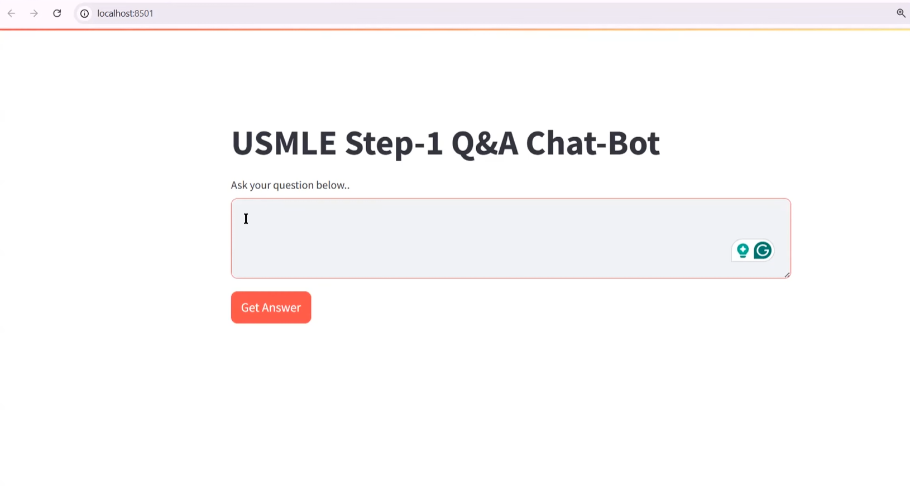

# 🧠 USMLE-RAG-Chatbot

An AI-powered study assistant designed to support medical students preparing for **USMLE Step 1**. This chatbot uses **RAG (Retrieval-Augmented Generation)** with medical-specific embeddings and real-time LLM generation to deliver detailed, accurate, and context-aware answers to medical questions.

> 💬 Ask a question → 🔍 Search through 900+ pages of Step 1 content → 🧾 Get structured and clinically relevant answers.

---

## 🚀 Overview

This project is a **Generative AI application** that combines:

- **LangChain** for orchestration,
- **Pinecone** for fast vector retrieval,
- **Hugging Face’s MedEmbed** model for medical embeddings, and
- **Google Gemini 1.5 Flash** for real-time, cost-effective response generation.

It offers USMLE Step 1 examinees a fast, interactive tool to enhance their study experience.

---

## 🩺 Features

- **Medical Query Answering**: Ask anything related to USMLE Step 1 (e.g., pathology, pharmacology, anatomy).
- **Contextual Retrieval**: Uses Pinecone to fetch relevant content chunks from curated medical PDFs.
- **Medical Embeddings**: Powered by `MedEmbed-large-v0.1`, optimized for clinical terminology.
- **Gemini 1.5 Flash Integration**: Low-latency, high-accuracy generation from Google’s GenAI models.
- **Streamlit UI**: Clean, responsive web interface.
- **Structured Responses**: Answers include summaries, comparisons, and tables when appropriate.
- **Consent Management**: Prompts users with a medical disclaimer before accessing chatbot features.

---

## 🧰 Tech Stack

| Component            | Tool/Library              |
|----------------------|---------------------------|
| Language Model       | Google Gemini 1.5 Flash   |
| Embeddings           | Hugging Face MedEmbed     |
| Vector DB            | Pinecone                  |
| Framework            | LangChain                 |
| Frontend             | Streamlit                 |
| Backend              | Python, Torch             |
| Environment Handling | dotenv                    |

---

## ⚙️ Installation

### 🔗 Prerequisites

- Python 3.8+
- API Keys for:
  - Pinecone
  - Google Generative AI
  - Hugging Face

### 📦 Setup Steps

```bash
# 1. Clone the repository
git clone https://github.com/<your-username>/USMLE-RAG-Chatbot.git
cd USMLE-RAG-Chatbot

# 2. Create and activate virtual environment
python -m venv venv
source venv/bin/activate     # On Windows: venv\Scripts\activate

# 3. Install dependencies
pip install -r requirements.txt

# 4. Add your API keys to a .env file
touch .env
```

```env
# .env file
PINECONE_API_KEY=your_pinecone_api_key
GOOGLE_API_KEY=your_google_api_key
HUGGINGFACE_API_KEY=your_huggingface_api_key
``` 

```bash
# 5. Run the Streamlit app
streamlit run app.py
```

### 📁 Project Structure
```text
├── app.py                 # Main Streamlit application
├── requirements.txt       # Python dependencies
├── .env.example           # Sample environment variables
├── utils/                 # Helper modules
│   ├── embeddings.py      # Embedding utilities
│   ├── retrieval.py       # Vector search functions
│   └── preprocessing.py   # Data cleaning
├── models/                # AI components
│   ├── medembed.py        # Medical embeddings
│   └── gemini.py          # LLM interface
└── data/                  # Knowledge base
    ├── raw/               # Original PDFs
    └── processed/         # Chunked JSON files
```

### 🔄 Workflow

## 💬 Example Queries

- "What are the risk factors for Type 2 Diabetes?"
- "Compare and contrast Crohn’s Disease and Ulcerative Colitis."
- "A 25-year-old man presents with fatigue and palpitations. What’s the most likely diagnosis?"

---

## ⚠️ Disclaimer

This chatbot is intended for **educational use only**.

- 🩺 **Not medical advice**: Always consult a healthcare provider.
- 🚨 **In emergencies**: Seek immediate medical attention.

---

## 🔮 Future Enhancements

- Fine-tuned models for even more accurate answers.
- Expand coverage to USMLE Step 2 and Step 3 materials.
- Add diagram/image generation for anatomy-based queries.
- Improve UX with audio explanations and interactive tools.
- Real-time query analytics and logging.

---

## 👥 Contributors

- **Julisa Delfin** – MS Data Science, DePaul University
[](https://www.linkedin.com/in/julisadelfin/)  
